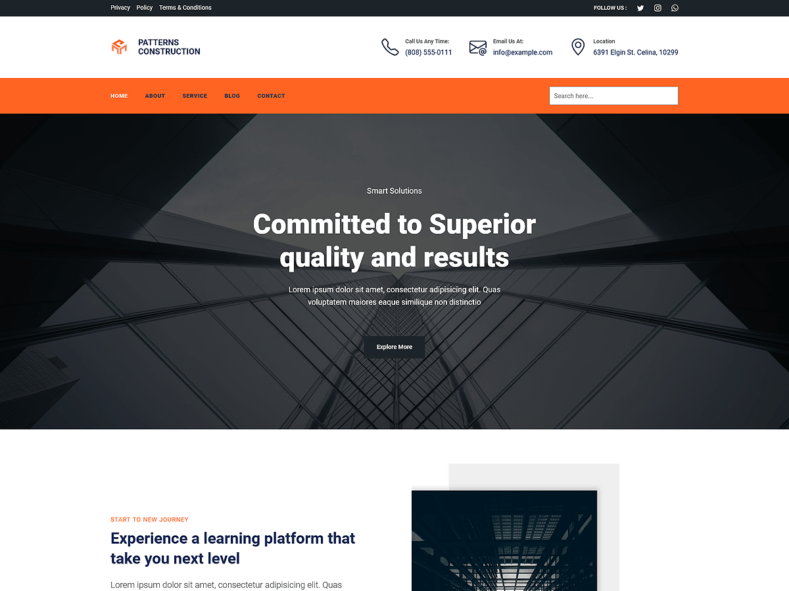

# Patterns Construction

Patterns Construction is a powerful and professional WordPress theme crafted for construction companies, contractors,engineering firms, and architects. Built with WordPress Full Site Editing (FSE), it enables seamless customization of headers, footers, templates, and global styles directly within the WordPress Site Editor. The theme includes pre-designed patterns and layouts tailored to showcase construction services, ongoing projects and contact information. It features ready-to-use sections for services, project highlights, about, contact page, and more. With its fully responsive design, your website will look sharp and reliable on all devices, making Patterns Construction an ideal platform to showcase your expertise and build trust with your clients.

Primary color: `#FF6422`.



## Features

- 3 hero and landing patterns
- 2 card layouts (card-1 through card-2)
- 1 service section pattern
- 5 archive/post-listing patterns
- Contact page pattern (page-contact)
- 1 menu navigation pattern
- 12 section layout patterns (featured sections and section titles)
- Full Site Editing (FSE) support
- Responsive design
- 61 block patterns + 15 templates + 11 template parts
- Construction industry layouts (services, projects, contact)

## Requirements

- WordPress 6.6 or higher
- PHP 7.0 or higher
- Tested up to WordPress 6.7

## Development

This theme uses `@wordpress/scripts`:

```sh
npm install
npm run start    # dev mode with watch
npm run build    # production build
```

## License

GNU General Public License v2 or later.

This theme is based on [WP Block Theme Boilerplate](https://github.com/codersantosh/wp-block-theme-boilerplate), (C) 2025 Santosh Kunwar, [GPLv2 or later](https://www.gnu.org/licenses/gpl-2.0.html).
